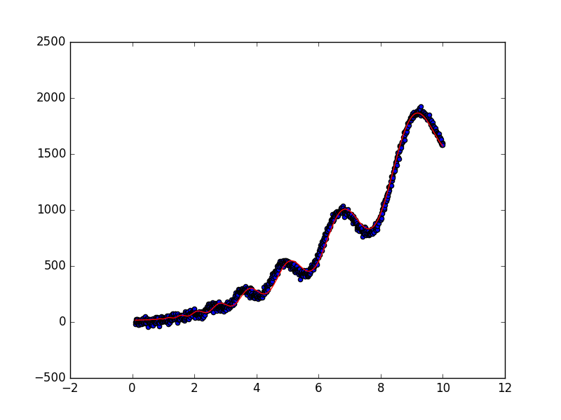

# Log-Periodic Power Laws

Log-periodic power law (LPPL) type behavior is interesting for a number of
reasons.  There is a
certain amount of empirical evidence and belief that it is fundamental
to many critical phenomena -- material rupture, earthquakes, and financial
bubbles, to name a few.  For a bit of background see the [docs](docs/) and
follow the references!

Here we consider the following generic log-periodic model:


## Non-linear fitting vs. Heuristic fitting

Interestingly, LPPL is in a class of functions which have many local minima,
when attempting to fit. This means that generic fits are pretty terrible, as
can be seen [here](images/lppl_curve_fit_fit.png).  Additionally there is the
curious feature that, if we attempt
to fit a least squares slightly away from the true parameter values, we still
may never find the global minimum, or the best fit.  This can be seen in
the following graph, where the parameters are

```
	p_true = {20, 2, 1, -2, 0.5, 3.0}
```

and the initial search parameters are

```
	p_initial = {21, 2, 1, -2, 0.5, 3.0}
```

with

```
	p_fit = {21.4, 2, 1, -2, 0.5, 3.0}.
```



There are a number of solutions to this problem, many of which require
[heuristic](https://en.wikipedia.org/wiki/Heuristic_(computer_science))
algorithms, which will find good solutions in these situations.
For the situation of many local minima, the algorithms generically hop around
parameter space, with some probability.  This is in contrast to many fitting
methods that zero in on the minimum, and are likely to get trapped.  These
heuristic algorithms include: simulated annealing, evolutionary algorithms,
tabu search, and others.

Below we have scipy's basinhopping fit, where the parameters are

```
	p_true = {20, 2, 2, 0.5, 3}
```
and the initial search parameters are
```
	p_initial = {1, 1, 1, 1, 1}
```
with
```
	p_fit = {20.00, 2.01, 0.95, 0.50, 1.0, 2.94}
```

